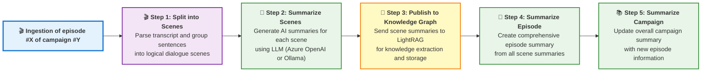

# Myrddin

Myrddin is an open-source project designed to extract and organize information from tabletop RPG audio recordings or transcripts. It built a knowledge graph of your campaign content that can be queried for specific information about characters, events, locations, and story elements.

## Features
- Ask questions about yours campaigns and get answers based a the knowledge graph
- Get context-aware summaries of episodes and campaigns
- Episodes can be ingested individually (**TBD**) or as part of a campaign
- Deploy locally or in the cloud (Azure)

## High-Level View


```mermaid
graph LR
    Start["`🎬 **Ingestion of episode #X of campaign #Y**`"]
    
    Start --> SplitScenes["`🎬 **Step 1: Split into Scenes**
    Parse transcript and group sentences
    into logical dialogue scenes`"]
    
    SplitScenes --> SummarizeScenes["`📝 **Step 2: Summarize Scenes** 
    Generate AI summaries for each scene
    using LLM (Azure OpenAI or Ollama)`"]
    
    SummarizeScenes --> PublishKG["`🚀 **Step 3: Publish to Knowledge Graph**
    Send scene summaries to LightRAG
    for knowledge extraction and storage`"]
    
    PublishKG --> SummarizeEpisode["`📖 **Step 4: Summarize Episode**
    Create comprehensive episode summary
    from all scene summaries`"]
    
    SummarizeEpisode --> SummarizeCampaign["`📚 **Step 5: Summarize Campaign**
    Update overall campaign summary
    with new episode information`"]
    
    %% Styling
    classDef startNode fill:#e3f2fd,stroke:#1976d2,stroke-width:3px
    classDef processNode fill:#f3e5f5,stroke:#7b1fa2,stroke-width:2px
    classDef aiNode fill:#e8f5e8,stroke:#388e3c,stroke-width:2px
    classDef kgNode fill:#fff9c4,stroke:#f57c00,stroke-width:2px
    classDef endNode fill:#e0f2f1,stroke:#00695c,stroke-width:3px
    
    class Start startNode
    class SplitScenes processNode
    class SummarizeScenes,SummarizeEpisode,SummarizeCampaign aiNode
    class PublishKG kgNode
    class Complete endNode
```

## Deployment

### Docker Compose (Recommended)

The easiest way to get started is using the Docker Compose setup in `deploy/locally`, which provides a complete stack with all dependencies:

```bash
cd deploy/locally


cp .env.example .env
# Edit .env and add your Hugging Face token:
# HUGGING_FACE_TOKEN=your_token_here

# Note : First run takes several minutes to download AI models)
docker compose up
```

#### Services
The Docker Compose setup provides:
- **Main Application**: Summarizer service built from the ingester
- **Local AI Stack**: Ollama with phi4-mini and bge-m3 models
- **Knowledge Graph**: LightRAG server for campaign data storage
- **Infrastructure**: Redis, Dapr services for workflow orchestration
- **Monitoring**: Aspire Dashboard for observability

#### Endpoints
Once running, access:
- **Main Application (Swagger)**: http://localhost:8001/docs
- **LightRAG Knowledge Graph (UI)**: http://localhost:9622
- **Aspire Dashboard (Logs)**: http://localhost:18890

This deployment is fully offline and ideal for development, testing, or running without cloud dependencies.
To start ingesting episodes :
- Put the audio files in `deploy/locally/storage/audios`
- Using the swagger UI (http://localhost:8001/docs), call the POST `/workflows/audio` endpoint with the audio file name and campaign/episode IDs.
- Once the workflow is completed:
  -  You'll find the summaries in the `deploy/locally/storage/summaries/{campaign_id}/{episode_id}/` directory.
     - The `episode.json` file contains the full episode summary.
     - The `scenes/` directory contains individual scene summaries.
     - The campaign summary is stored in `campaign.json` at the root of the summaries directory.
  - You will be able to query the knowledge graph at http://localhost:9622, using the UI or programmatically.

Example : Starting workflow for the provided audio file `1m.ogg`:
```http
POST /workflows/audio
Content-Type: application/json
{
  "audio_file_path": "1m.ogg",
  "campaign_id": 1,
  "episode_id": 1
}
```


### Azure (TBD)

## Configuration

### Environment Variables

This project uses the following environment variables:

| env variable                                                        | description                                                                                                                                                                                     | required    | default                |
| ------------------------------------------------------------------- | ----------------------------------------------------------------------------------------------------------------------------------------------------------------------------------------------- | ----------- | ---------------------- |
| **Provider Configuration**                                          |                                                                                                                                                                                                 |             |                        |
| CHAT_COMPLETION_PROVIDER                                            | Chat completion provider: "azure" or "ollama"                                                                                                                                                   | true        | azure                  |
| AUDIO_COMPLETION_PROVIDER                                           | Audio transcription provider: "azure" or "local"                                                                                                                                                | true        | local                  |
| **Azure Configuration**                                             |                                                                                                                                                                                                 |             |                        |
| AI_FOUNDRY_PROJECT_ENDPOINT                                         | Azure AI Foundry project endpoint (required when CHAT_COMPLETION_PROVIDER="azure")                                                                                                              | conditional |                        |
| AZURE_CHAT_DEPLOYMENT_NAME                                          | Azure model deployment name for chat completion (required when CHAT_COMPLETION_PROVIDER="azure")                                                                                                | conditional |                        |
| AZURE_AUDIO_DEPLOYMENT_NAME                                         | Azure model deployment name for speech to text (required when AUDIO_COMPLETION_PROVIDER="azure")                                                                                                | conditional |                        |
| **Ollama Configuration**                                            |                                                                                                                                                                                                 |             |                        |
| OLLAMA_ENDPOINT                                                     | Ollama server endpoint (required when CHAT_COMPLETION_PROVIDER="ollama")                                                                                                                        | conditional | http://localhost:11434 |
| OLLAMA_MODEL_NAME                                                   | Ollama model name to use (required when CHAT_COMPLETION_PROVIDER="ollama")                                                                                                                      | conditional | phi4                   |
| **General Configuration**                                           |                                                                                                                                                                                                 |             |                        |
| HUGGING_FACE_TOKEN                                                  | Hugging Face API token. Required for speaker diarization. **You must accept model terms and conditions, see [here](https://github.com/m-bain/whisperX?tab=readme-ov-file#speaker-diarization)** | true        |                        |
| LANGUAGE                                                            | Language for text generation. The summary will be generated in this language                                                                                                                    | false       | English                |
| INFERENCE_DEVICE                                                    | Device for ML inference (cpu, cuda)                                                                                                                                                             | false       | cpu                    |
| HTTP_HOST                                                           | HTTP server host                                                                                                                                                                                | false       | 0.0.0.0                |
| HTTP_PORT                                                           | HTTP server port                                                                                                                                                                                | false       | 8000                   |
| **Knowledge Graph Configuration**                                   |                                                                                                                                                                                                 |             |                        |
| LIGHTRAG_ENDPOINT                                                   | LightRAG server endpoint for knowledge graph integration                                                                                                                                        | false       | http://localhost:9621  |
| LIGHTRAG_API_KEY                                                    | API key for LightRAG server authentication                                                                                                                                                      | false       | quackquack             |
| **Dapr Configuration**                                              |                                                                                                                                                                                                 |             |                        |
| DAPR_AUDIO_STORE_NAME                                               | Dapr binding name for audio store                                                                                                                                                               | false       | audio-store            |
| DAPR_SUMMARY_STORE_NAME                                             | Dapr binding name for summary store                                                                                                                                                             | false       | summary-store          |
| DAPR_NOTIFICATION_PUBSUB_NAME                                       | Dapr pub/sub component name for notifications. Set to empty/unset to disable notifications                                                                                                      | false       | notification-pubsub    |
| DAPR_NOTIFICATION_PUBSUB_TOPIC                                      | Dapr pub/sub topic name for notifications                                                                                                                                                       | false       | notifications          |
| **Observability**                                                   |                                                                                                                                                                                                 |             |                        |
| OTEL_EXPORTER_OTLP_ENDPOINT                                         | OpenTelemetry Protocol (OTLP) endpoint                                                                                                                                                          | false       | http://localhost:4317  |
| SEMANTICKERNEL_EXPERIMENTAL_GENAI_ENABLE_OTEL_DIAGNOSTICS_SENSITIVE | Enable sensitive diagnostics data collection                                                                                                                                                    | false       | false                  |
| **Azure Authentication**                                            |                                                                                                                                                                                                 |             |                        |
| AZURE_TENANT_ID                                                     | [Azure tenant ID](https://learn.microsoft.com/en-us/azure/developer/python/azure-sdk-authenticate#service-principal) (for service principal auth)                                               | false       |                        |
| AZURE_CLIENT_ID                                                     | [Azure client ID](https://learn.microsoft.com/en-us/azure/developer/python/azure-sdk-authenticate#service-principal) (for service principal auth)                                               | false       |                        |
| AZURE_CLIENT_SECRET                                                 | [Azure client secret](https://learn.microsoft.com/en-us/azure/developer/python/azure-sdk-authenticate#service-principal) (for service principal auth)                                           | false       |                        |

### Dapr components
#### Setting up Dapr components

This project uses three Dapr components:

| Component         | Type        | Purpose                                                                                                                           | Default Implementation                                  |
| ----------------- | ----------- | --------------------------------------------------------------------------------------------------------------------------------- | ------------------------------------------------------- |
| **state-store**   | State Store | Actor storage for [Workflows execution](https://docs.dapr.io/developing-applications/building-blocks/workflow/workflow-overview/) | Redis (in-memory)                                       |
| **audio-store**   | Binding     | Object storage for audio files (input)                                                                                            | Local file system (`ingester/data/audios` directory)    |
| **summary-store** | Binding     | Object storage for summary files (output)                                                                                         | Local file system (`ingester/data/generated` directory) |

The default components are configured for local development and use Redis for state management and the local file system for file storage. These can be reconfigured for production environments to use cloud storage services like Azure Blob Storage or AWS S3.

## Contributing 

All contributions are welcome! Please open issues or pull requests for any features, bug fixes, or improvements.

You can use the provided devcontainer setup for a consistent development environment.

### Limiations
- The audio file size is currently limited to 500MB due to gRPC message size limits. This can be adjusted in `dapr_storage.py` if needed.