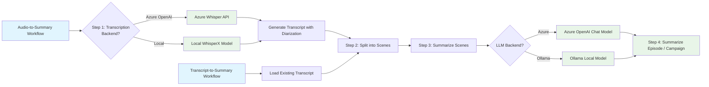

# TTRPG summarizer

This project is a FastAPI + Dapr Workflows service that turns tabletop RPG recordings into structured summaries. It transcribes audio and process the transcription to provide a summary of what happened during the episode or campaign

## Features

- Pluggable speech-to-text (Supported backend: Azure OpenAI or local Whisper)
- Detailed summarization using Semantic Kernel (Supported backend: Azure OpenAI)
- FastAPI HTTP API to kick off workflows
- Configurable data source and destination using Dapr bindings
- OpenTelemetry traces, logs, and metrics (OTLP/gRPC)

## Usage

The purpose of this project is to provide a seamless way to generate structured summaries from tabletop RPG recordings. This project uses [Dapr](https://github.com/dapr/dapr).

### Configuration

You can independently choose your **LLM provider** (Azure AI Foundry or Ollama) and **Audio transcription provider** (Azure or local Whisper). The choices are controlled by two environment variables:

- `CHAT_COMPLETION_PROVIDER`: "azure" or "ollama" 
- `AUDIO_COMPLETION_PROVIDER`: "azure" or "local"

#### Setup

1. Copy the example environment file:
```bash
cp summarizer/.env.example summarizer/.env
```

2. Edit the `.env` file to configure your providers:

**Chat Completion Provider:**
- For Azure: Set `CHAT_COMPLETION_PROVIDER="azure"` and configure `AI_FOUNDRY_PROJECT_ENDPOINT` + `AZURE_CHAT_DEPLOYMENT_NAME`
- For Ollama: Set `CHAT_COMPLETION_PROVIDER="ollama"` and configure `OLLAMA_ENDPOINT` + `OLLAMA_MODEL_NAME`

**Audio Transcription Provider:**
- For Azure: Set `AUDIO_COMPLETION_PROVIDER="azure"` and configure `AZURE_AUDIO_DEPLOYMENT_NAME`
- For Local: Set `AUDIO_COMPLETION_PROVIDER="local"` (uses local Whisper, no additional config needed)

#### Common Configurations

**Full Azure (Recommended for production):**
```bash
CHAT_COMPLETION_PROVIDER="azure"
AUDIO_COMPLETION_PROVIDER="azure"
AI_FOUNDRY_PROJECT_ENDPOINT="https://<name>.services.ai.azure.com/api/projects/<project-name>"
AZURE_CHAT_DEPLOYMENT_NAME="<your_chat_model>"
AZURE_AUDIO_DEPLOYMENT_NAME="whisper"
```

**Full Local (Best for development):**
```bash
CHAT_COMPLETION_PROVIDER="ollama"
AUDIO_COMPLETION_PROVIDER="local"
OLLAMA_ENDPOINT="http://localhost:11434"
OLLAMA_MODEL_NAME="phi4"
```

**Mixed (Azure Chat + Local Audio):**
```bash
CHAT_COMPLETION_PROVIDER="azure"
AUDIO_COMPLETION_PROVIDER="local"
AI_FOUNDRY_PROJECT_ENDPOINT="https://<name>.services.ai.azure.com/api/projects/<project-name>"
AZURE_CHAT_DEPLOYMENT_NAME="<your_chat_model>"
```

#### Prerequisites

**For Ollama:** Ensure Ollama is running locally:
```bash
ollama serve
ollama pull phi4  # or your preferred model
```

**For any configuration:** Set your Hugging Face token:
```bash
HUGGING_FACE_TOKEN=<your_token_here>
```
Required for speaker diarization regardless of which providers you choose.

### Sample output
```json
{
  "session_overview": "The party investigates mysterious disappearances in the village of Millhaven, uncovering a cult of shadow worshippers operating from beneath the old mill. After infiltrating their lair and confronting the cult leader, they rescue the missing villagers and discover ancient artifacts tied to a larger conspiracy threatening the realm.",
  "key_events": [
    "Party arrives in Millhaven and learns about the missing villagers from Mayor Aldric",
    "Investigation at the old mill reveals hidden entrance to underground chambers",
    "Encounter with shadow cultists and their summoned creatures",
    "Discovery of ritual chamber with imprisoned villagers",
    "Confrontation with Cultist Leader Malachar and disruption of the shadow ritual",
    "Rescue of villagers and seizure of the Shadow Crystal artifact",
    "Village celebration and revelation of larger threat from the Order of the Void"
  ],
  "character_updates": [
    {
      "name": "Thorin Ironbeard",
      "changes": [
        "Gained experience in detecting undead creatures",
        "Formed strong bond with rescued villager child, Tommy",
        "Acquired minor curse from Shadow Crystal exposure (temporary strength reduction)"
      ]
    },
    {
      "name": "Lyra Moonwhisper",
      "changes": [
        "Successfully identified and dispelled shadow magic wards",
        "Learned new spell: Detect Evil and Good from studying cult texts",
        "Established contact with local nature spirits who aided the investigation"
      ]
    },
    {
      "name": "Garrett the Swift",
      "changes": [
        "Demonstrated exceptional stealth skills infiltrating the cult lair",
        "Suffered moderate injuries from shadow creature claws (healing required)",
        "Discovered hidden talent for reading ancient runic inscriptions"
      ]
    }
  ],
  "npc_updates": [
    {
      "name": "Mayor Aldric Stoneheart",
      "details": [
        "Revealed knowledge of ancient mill's dark history",
        "Offered party permanent residence in Millhaven as reward",
        "Requested party's aid in fortifying village defenses"
      ]
    },
    {
      "name": "Malachar the Shadow Binder",
      "details": [
        "Cult leader seeking to summon avatar of shadow deity",
        "Escaped through shadow portal after ritual disruption",
        "Left behind journal revealing Order of the Void connections",
        "Holds personal vendetta against Lyra's mentor, Archdruid Elara"
      ]
    },
    {
      "name": "Tommy Fletcher",
      "details": [
        "Young villager rescued from cult sacrifice",
        "Witnessed cult's planning meetings while imprisoned",
        "Possesses natural resistance to shadow magic",
        "Became honorary member of the party"
      ]
    }
  ],
  "items_and_clues": [
    {
      "name": "Shadow Crystal",
      "description": "Dark crystalline artifact used to focus shadow magic rituals",
      "significance": "Key component for summoning shadow entities; multiple crystals exist across the realm"
    },
    {
      "name": "Malachar's Journal",
      "description": "Leather-bound tome containing cult plans and Order of the Void intelligence",
      "significance": "Reveals locations of other cult cells and upcoming convergence ritual"
    },
    {
      "name": "Ancient Mill Blueprints",
      "description": "Original architectural plans showing hidden chambers and passages",
      "significance": "Indicates mill was purposely built over ancient shadow temple site"
    },
    {
      "name": "Rune-carved Daggers",
      "description": "Set of three ceremonial daggers with shadow magic inscriptions",
      "significance": "Required implements for shadow summoning rituals; one still missing"
    },
    {
      "name": "Villager Testimonies",
      "description": "Accounts from rescued villagers about cult recruitment methods",
      "significance": "Reveals cult has infiltrated other nearby settlements"
    }
  ],
  "open_threads": [
    {
      "description": "Malachar escaped and threatens revenge against the party, particularly Lyra",
      "priority": "high",
      "related_characters": ["Malachar", "Lyra Moonwhisper"]
    },
    {
      "description": "The Order of the Void plans a major convergence ritual in three months",
      "priority": "high", 
      "related_characters": ["Order of the Void", "Party"]
    },
    {
      "description": "Third ceremonial dagger remains unaccounted for and is needed for cult rituals",
      "priority": "medium",
      "related_characters": ["Party", "Order of the Void"]
    },
    {
      "description": "Tommy's natural shadow magic resistance may be key to stopping the Order",
      "priority": "medium",
      "related_characters": ["Tommy Fletcher", "Party"]
    },
    {
      "description": "Connection between Malachar and Archdruid Elara's past needs investigation",
      "priority": "medium",
      "related_characters": ["Malachar", "Lyra Moonwhisper", "Archdruid Elara"]
    },
    {
      "description": "Other villages mentioned in cult documents require warning and protection",
      "priority": "low",
      "related_characters": ["Party", "Village leaders"]
    }
  ],
  "continuity_notes": [
    "Thorin's curse will require magical healing or will fade naturally in 1-2 sessions",
    "Garrett's injuries need proper medical attention before next adventure",
    "Tommy should be integrated as recurring NPC who provides local knowledge",
    "Shadow Crystal's influence may affect party members who carried it for extended periods",
    "Mayor Aldric expects regular updates on Order of the Void threat",
    "Nature spirits contacted by Lyra may provide ongoing intelligence about shadow magic activity",
    "Party reputation in Millhaven grants advantage on social interactions with villagers"
  ]
}
```

## Configuration

### Environment Variables

This project uses the following environment variables:

| env variable                                                        | description                                                                                                                                                                                     | required    | default                |
| ------------------------------------------------------------------- | ----------------------------------------------------------------------------------------------------------------------------------------------------------------------------------------------- | ----------- | ---------------------- |
| **Provider Configuration**                                          |                                                                                                                                                                                                 |             |                        |
| CHAT_COMPLETION_PROVIDER                                            | Chat completion provider: "azure" or "ollama"                                                                                                                                                   | true        | azure                  |
| AUDIO_COMPLETION_PROVIDER                                           | Audio transcription provider: "azure" or "local"                                                                                                                                                | true        | local                  |
| **Azure Configuration**                                             |                                                                                                                                                                                                 |             |                        |
| AI_FOUNDRY_PROJECT_ENDPOINT                                         | Azure AI Foundry project endpoint (required when CHAT_COMPLETION_PROVIDER="azure")                                                                                                              | conditional |                        |
| AZURE_CHAT_DEPLOYMENT_NAME                                          | Azure model deployment name for chat completion (required when CHAT_COMPLETION_PROVIDER="azure")                                                                                                | conditional |                        |
| AZURE_AUDIO_DEPLOYMENT_NAME                                         | Azure model deployment name for speech to text (required when AUDIO_COMPLETION_PROVIDER="azure")                                                                                                | conditional |                        |
| **Ollama Configuration**                                            |                                                                                                                                                                                                 |             |                        |
| OLLAMA_ENDPOINT                                                     | Ollama server endpoint (required when CHAT_COMPLETION_PROVIDER="ollama")                                                                                                                        | conditional | http://localhost:11434 |
| OLLAMA_MODEL_NAME                                                   | Ollama model name to use (required when CHAT_COMPLETION_PROVIDER="ollama")                                                                                                                      | conditional | phi4                   |
| **General Configuration**                                           |                                                                                                                                                                                                 |             |                        |
| HUGGING_FACE_TOKEN                                                  | Hugging Face API token. Required for speaker diarization. **You must accept model terms and conditions, see [here](https://github.com/m-bain/whisperX?tab=readme-ov-file#speaker-diarization)** | true        |                        |
| INFERENCE_DEVICE                                                    | Device for ML inference (cpu, cuda)                                                                                                                                                             | false       | cpu                    |
| HTTP_HOST                                                           | HTTP server host                                                                                                                                                                                | false       | 0.0.0.0                |
| HTTP_PORT                                                           | HTTP server port                                                                                                                                                                                | false       | 8000                   |
| **Dapr Configuration**                                              |                                                                                                                                                                                                 |             |                        |
| DAPR_AUDIO_STORE_NAME                                               | Dapr binding name for audio store                                                                                                                                                               | false       | audio-store            |
| DAPR_SUMMARY_STORE_NAME                                             | Dapr binding name for summary store                                                                                                                                                             | false       | summary-store          |
| **Observability**                                                   |                                                                                                                                                                                                 |             |                        |
| OTLP_ENDPOINT                                                       | OpenTelemetry Protocol (OTLP) endpoint                                                                                                                                                          | false       | http://localhost:4317  |
| SEMANTICKERNEL_EXPERIMENTAL_GENAI_ENABLE_OTEL_DIAGNOSTICS_SENSITIVE | Enable sensitive diagnostics data collection                                                                                                                                                    | false       | false                  |
| **Azure Authentication**                                            |                                                                                                                                                                                                 |             |                        |
| AZURE_TENANT_ID                                                     | [Azure tenant ID](https://learn.microsoft.com/en-us/azure/developer/python/azure-sdk-authenticate#service-principal) (for service principal auth)                                               | false       |                        |
| AZURE_CLIENT_ID                                                     | [Azure client ID](https://learn.microsoft.com/en-us/azure/developer/python/azure-sdk-authenticate#service-principal) (for service principal auth)                                               | false       |                        |
| AZURE_CLIENT_SECRET                                                 | [Azure client secret](https://learn.microsoft.com/en-us/azure/developer/python/azure-sdk-authenticate#service-principal) (for service principal auth)                                           | false       |                        |

## Data flow  




