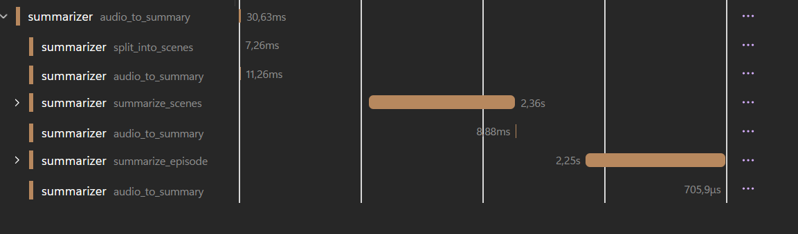

# TTRPG summarizer and Q&A

This project is made to be able to extract information from tabletop RPG audio recordings. Specifically, it:
- Transcribes the recording and creates structured summaries.
- Feeds a knowledge graph that you can query for insights.

## Features

- Pluggable speech-to-text (Supported backend: Azure OpenAI or local Whisper)
- Detailed summarization using Semantic Kernel (Supported backend: Azure OpenAI)
- **Knowledge Graph Integration** with LightRAG for enhanced information retrieval and context-aware queries
- FastAPI HTTP API to kick off workflows
- Configurable data source and destination using Dapr bindings
- OpenTelemetry traces, logs, and metrics (OTLP/gRPC)

<details>
<summary><strong>Sample output</strong></summary>

```json
{
  "session_overview": "The party investigates mysterious disappearances in the village of Millhaven, uncovering a cult of shadow worshippers operating from beneath the old mill. After infiltrating their lair and confronting the cult leader, they rescue the missing villagers and discover ancient artifacts tied to a larger conspiracy threatening the realm.",
  "key_events": [
    "Party arrives in Millhaven and learns about the missing villagers from Mayor Aldric",
    "Investigation at the old mill reveals hidden entrance to underground chambers",
    "Encounter with shadow cultists and their summoned creatures",
    "Discovery of ritual chamber with imprisoned villagers",
    "Confrontation with Cultist Leader Malachar and disruption of the shadow ritual",
    "Rescue of villagers and seizure of the Shadow Crystal artifact",
    "Village celebration and revelation of larger threat from the Order of the Void"
  ],
  "character_updates": [
    {
      "name": "Thorin Ironbeard",
      "changes": [
        "Gained experience in detecting undead creatures",
        "Formed strong bond with rescued villager child, Tommy",
        "Acquired minor curse from Shadow Crystal exposure (temporary strength reduction)"
      ]
    },
    {
      "name": "Lyra Moonwhisper",
      "changes": [
        "Successfully identified and dispelled shadow magic wards",
        "Learned new spell: Detect Evil and Good from studying cult texts",
        "Established contact with local nature spirits who aided the investigation"
      ]
    },
    {
      "name": "Garrett the Swift",
      "changes": [
        "Demonstrated exceptional stealth skills infiltrating the cult lair",
        "Suffered moderate injuries from shadow creature claws (healing required)",
        "Discovered hidden talent for reading ancient runic inscriptions"
      ]
    }
  ],
  "npc_updates": [
    {
      "name": "Mayor Aldric Stoneheart",
      "details": [
        "Revealed knowledge of ancient mill's dark history",
        "Offered party permanent residence in Millhaven as reward",
        "Requested party's aid in fortifying village defenses"
      ]
    },
    {
      "name": "Malachar the Shadow Binder",
      "details": [
        "Cult leader seeking to summon avatar of shadow deity",
        "Escaped through shadow portal after ritual disruption",
        "Left behind journal revealing Order of the Void connections",
        "Holds personal vendetta against Lyra's mentor, Archdruid Elara"
      ]
    },
    {
      "name": "Tommy Fletcher",
      "details": [
        "Young villager rescued from cult sacrifice",
        "Witnessed cult's planning meetings while imprisoned",
        "Possesses natural resistance to shadow magic",
        "Became honorary member of the party"
      ]
    }
  ],
  "items_and_clues": [
    {
      "name": "Shadow Crystal",
      "description": "Dark crystalline artifact used to focus shadow magic rituals",
      "significance": "Key component for summoning shadow entities; multiple crystals exist across the realm"
    },
    {
      "name": "Malachar's Journal",
      "description": "Leather-bound tome containing cult plans and Order of the Void intelligence",
      "significance": "Reveals locations of other cult cells and upcoming convergence ritual"
    },
    {
      "name": "Ancient Mill Blueprints",
      "description": "Original architectural plans showing hidden chambers and passages",
      "significance": "Indicates mill was purposely built over ancient shadow temple site"
    },
    {
      "name": "Rune-carved Daggers",
      "description": "Set of three ceremonial daggers with shadow magic inscriptions",
      "significance": "Required implements for shadow summoning rituals; one still missing"
    },
    {
      "name": "Villager Testimonies",
      "description": "Accounts from rescued villagers about cult recruitment methods",
      "significance": "Reveals cult has infiltrated other nearby settlements"
    }
  ],
  "open_threads": [
    {
      "description": "Malachar escaped and threatens revenge against the party, particularly Lyra",
      "priority": "high",
      "related_characters": ["Malachar", "Lyra Moonwhisper"]
    },
    {
      "description": "The Order of the Void plans a major convergence ritual in three months",
      "priority": "high", 
      "related_characters": ["Order of the Void", "Party"]
    },
    {
      "description": "Third ceremonial dagger remains unaccounted for and is needed for cult rituals",
      "priority": "medium",
      "related_characters": ["Party", "Order of the Void"]
    },
    {
      "description": "Tommy's natural shadow magic resistance may be key to stopping the Order",
      "priority": "medium",
      "related_characters": ["Tommy Fletcher", "Party"]
    },
    {
      "description": "Connection between Malachar and Archdruid Elara's past needs investigation",
      "priority": "medium",
      "related_characters": ["Malachar", "Lyra Moonwhisper", "Archdruid Elara"]
    },
    {
      "description": "Other villages mentioned in cult documents require warning and protection",
      "priority": "low",
      "related_characters": ["Party", "Village leaders"]
    }
  ],
  "continuity_notes": [
    "Thorin's curse will require magical healing or will fade naturally in 1-2 sessions",
    "Garrett's injuries need proper medical attention before next adventure",
    "Tommy should be integrated as recurring NPC who provides local knowledge",
    "Shadow Crystal's influence may affect party members who carried it for extended periods",
    "Mayor Aldric expects regular updates on Order of the Void threat",
    "Nature spirits contacted by Lyra may provide ongoing intelligence about shadow magic activity",
    "Party reputation in Millhaven grants advantage on social interactions with villagers"
  ]
}
```

</details>

## Usage

### Locally
This will show a basic configuration. For additional parameters, refer to the [configuration](#configuration) section.

First, **open the devcontainer** with your preferred editor. 

Then copy the `.env.example` file to `.env`.
```bash
# Fill the values in .env
# You will especially need the HUGGING_FACE_TOKEN 
# By default, the .env file is configured for local development with Ollama
cp summarizer/.env.example summarizer/.env
```

You will need to fill in the values for your environment variables, especially the `HUGGING_FACE_TOKEN`. This is requirement to use [WhisperX](https://github.com/m-bain/whisperX).
Following [these instructions](https://github.com/m-bain/whisperX?tab=readme-ov-file#speaker-diarization), retrieve your token and accept the terms and conditions of the required models.

#### Setting up the chat completion model

**Note**: Ollama is already configured in the devcontainer.

Then start ollama and pull [phi4](https://ollama.com/library/phi4) SLM. This is the model that will be used for chat completion. Any model supporting structured output can be used, remember to change the `OLLAMA_MODEL_NAME` accordingly.

```bash
ollama serve
# Phi 4 is ~10GiB, Phi4 mini is ~2.5GiB
ollama pull phi4
```

#### Setting up the speech to text model

By default, the speech to text model is set to use a local version of [Whisper X](https://github.com/m-bain/whisperX?tab=readme-ov-file#speaker-diarization). The models used by whisperX will be downloaded during the application execution. So there is no additional configuration needed.

#### Setting up the Knowledge Graph (LightRAG)

**Note**: The LightRag server is already started in the devcontainer.

Currently, the chosen knowledge graph is [LightRAG](https://github.com/HKUDS/LightRAG), which will enable the Q&A part of the application.
To start the LightRAG server:

```bash
# Navigate to the rag directory
cd rag

# Copy the example environment file and configure it
cp .env.example .env

# Start the LightRAG server (uses Docker)
./start-lightrag-server.sh
```

The LightRAG server will be available at `http://localhost:9621` and will be fed the scenes informations during workflow execution. This creates a searchable knowledge graph of your campaign content that can be queried for specific information about characters, events, locations, and story elements.

#### Setting up Dapr components

This project uses three Dapr components:

| Component         | Type        | Purpose                                                                                                                           | Default Implementation                                    |
| ----------------- | ----------- | --------------------------------------------------------------------------------------------------------------------------------- | --------------------------------------------------------- |
| **state-store**   | State Store | Actor storage for [Workflows execution](https://docs.dapr.io/developing-applications/building-blocks/workflow/workflow-overview/) | Redis (in-memory)                                         |
| **audio-store**   | Binding     | Object storage for audio files (input)                                                                                            | Local file system (`summarizer/data/audios` directory)    |
| **summary-store** | Binding     | Object storage for summary files (output)                                                                                         | Local file system (`summarizer/data/generated` directory) |

The default components are configured for local development and use Redis for state management and the local file system for file storage. These can be reconfigured for production environments to use cloud storage services like Azure Blob Storage or AWS S3.

First check that dapr is running. It should be automatically started in the devcontainer. 

```bash 
dapr version
# Expected output (versions can change)
# CLI version: 1.15.2 
# Runtime version: 1.15.10
```

#### Running the application

When everything is ready, you can run this command :

```bash
# The logs will be stored in .dapr/logs directory
dapr run -f .
```

Once the app started, in another terminal, you can trigger the audio to summary workflow by making a POST request to the API:

```bash
curl -X POST "http://localhost:8000/workflows/audio" \
  -H "Content-Type: application/json" \
  -d '{
    "audio_file_path": "1m.ogg",
    "campaign_id": 1,
    "episode_id": 1
  }' | jq

```

Sample output 

```json
{
  "_WorkflowState__obj": {
    "instance_id": "bddfe1140bd9476696932983c7287351",
    "name": "audio_to_summary",
    "runtime_status": 0,
    "created_at": "2025-08-26T14:23:00.237893",
    "last_updated_at": "2025-08-26T14:23:00.246679",
    "serialized_input": "{\"campaign_id\": 1, \"episode_id\": 1, \"audio_file_path\": \"1m.ogg\"}",
    "serialized_output": null,
    "serialized_custom_status": null,
    "failure_details": null
  }
```
The instance ID allow you to follow the workflow progress.

```bash
curl -X GET "http://localhost:8000/workflows/<instance_id>" | jq
```


An instance of the Aspire Dashboard is also running in the devcontainer. You can access it at http://localhost:18888. This will allow you to follow the workflow progress in a more visual way.



Once the workflow is done, you'll find the result in the `summarizer/data/generated` directory.

#### Result Files

The workflow generates several output files during processing, stored in the `summarizer/data/generated/{campaign_id}/{episode_id}/` directory:

| File              | Description                                | Content                                                                                                                       | When Generated                          |
| ----------------- | ------------------------------------------ | ----------------------------------------------------------------------------------------------------------------------------- | --------------------------------------- |
| `transcript.json` | Raw transcription with speaker diarization | Contains the full audio transcription with timestamps, speaker identification, and individual utterances                      | First step of audio-to-summary workflow |
| `scenes.json`     | Segmented dialogue scenes                  | Transcript split into logical scenes/segments based on conversation flow and topic changes                                    | Second step after transcription         |
| `episode.json`    | Complete episode summary                   | Structured summary containing session overview, key events, character updates, NPC details, items/clues, and continuity notes | Final step of both workflows            |

Each file builds upon the previous one, creating a pipeline from raw audio → transcription → scenes → final summary.

**Knowledge Graph Integration:** When LightRAG is enabled, scene summaries are automatically indexed into a knowledge graph during the workflow execution. This allows for semantic search and cross-episode queries about your campaign content.


## Configuration

You can independently choose your **LLM provider** (Azure AI Foundry or Ollama) and **Audio transcription provider** (Azure or local Whisper). The choices are controlled by two environment variables:

- `CHAT_COMPLETION_PROVIDER`: "azure" or "ollama" 
- `AUDIO_COMPLETION_PROVIDER`: "azure" or "local"

**Chat Completion Provider:**
- For Azure: Set `CHAT_COMPLETION_PROVIDER="azure"` and configure `AI_FOUNDRY_PROJECT_ENDPOINT` + `AZURE_CHAT_DEPLOYMENT_NAME`
- For Ollama: Set `CHAT_COMPLETION_PROVIDER="ollama"` and configure `OLLAMA_ENDPOINT` + `OLLAMA_MODEL_NAME`

**Audio Transcription Provider:**
- For Azure: Set `AUDIO_COMPLETION_PROVIDER="azure"` and configure `AZURE_AUDIO_DEPLOYMENT_NAME`
- For Local: Set `AUDIO_COMPLETION_PROVIDER="local"` (uses local Whisper, no additional config needed)

### Common Configurations

**Full Azure (Recommended for production):**
```bash
CHAT_COMPLETION_PROVIDER="azure"
AUDIO_COMPLETION_PROVIDER="azure"
AI_FOUNDRY_PROJECT_ENDPOINT="https://<name>.services.ai.azure.com/api/projects/<project-name>"
AZURE_CHAT_DEPLOYMENT_NAME="<your_chat_model>"
AZURE_AUDIO_DEPLOYMENT_NAME="whisper"
```

**Full Local (Best for development):**
```bash
CHAT_COMPLETION_PROVIDER="ollama"
AUDIO_COMPLETION_PROVIDER="local"
OLLAMA_ENDPOINT="http://localhost:11434" # Or any host ollama is running on
OLLAMA_MODEL_NAME="phi4"
```

**Mixed (Azure Chat + Local Audio):**
```bash
CHAT_COMPLETION_PROVIDER="azure"
AUDIO_COMPLETION_PROVIDER="local"
AI_FOUNDRY_PROJECT_ENDPOINT="https://<name>.services.ai.azure.com/api/projects/<project-name>"
AZURE_CHAT_DEPLOYMENT_NAME="<your_chat_model>"
```

**Knowledge Graph Integration (Optional):**
To enable knowledge graph features, also configure:
```bash
LIGHTRAG_ENDPOINT="http://localhost:9621"
LIGHTRAG_API_KEY="quackquack"
```

**For any configuration:** Set your Hugging Face token:
```bash
HUGGING_FACE_TOKEN=<your_token_here>
```
Required for speaker diarization regardless of which providers you choose.
See [here](https://github.com/m-bain/whisperX?tab=readme-ov-file#speaker-diarization). 

### Querying the Knowledge Graph

Once your episodes have been processed and indexed into the knowledge graph, you can query it for specific information about your campaign. The knowledge graph supports natural language queries and can provide context-aware responses across episodes.

**Programmatic Querying:**
The knowledge graph can be queried programmatically through the `KnowledgeGraph` service:

```python
# Query for information across a specific campaign
response = await knowledge_graph.query(
    "What NPCs have the party encountered?", 
    campaign_id=1, 
    episode_id=None  # Query across all episodes
)

# Query for information in a specific episode
response = await knowledge_graph.query(
    "What happened in the tavern scene?", 
    campaign_id=1, 
    episode_id=3
)
```

**LightRAG Web Interface:**
You can also access the LightRAG web interface directly at `http://localhost:9621` to interactively query your knowledge graph and visualize the relationships between entities in your campaign.

**Example Queries:**
- "What are the main NPCs in this campaign?"
- "Show me all encounters with dragons"
- "What items has the party collected?"
- "Summarize the relationship between [Character A] and [Character B]"
- "What plot threads are still unresolved?" 


### Environment Variables

This project uses the following environment variables:

| env variable                                                        | description                                                                                                                                                                                     | required    | default                |
| ------------------------------------------------------------------- | ----------------------------------------------------------------------------------------------------------------------------------------------------------------------------------------------- | ----------- | ---------------------- |
| **Provider Configuration**                                          |                                                                                                                                                                                                 |             |                        |
| CHAT_COMPLETION_PROVIDER                                            | Chat completion provider: "azure" or "ollama"                                                                                                                                                   | true        | azure                  |
| AUDIO_COMPLETION_PROVIDER                                           | Audio transcription provider: "azure" or "local"                                                                                                                                                | true        | local                  |
| **Azure Configuration**                                             |                                                                                                                                                                                                 |             |                        |
| AI_FOUNDRY_PROJECT_ENDPOINT                                         | Azure AI Foundry project endpoint (required when CHAT_COMPLETION_PROVIDER="azure")                                                                                                              | conditional |                        |
| AZURE_CHAT_DEPLOYMENT_NAME                                          | Azure model deployment name for chat completion (required when CHAT_COMPLETION_PROVIDER="azure")                                                                                                | conditional |                        |
| AZURE_AUDIO_DEPLOYMENT_NAME                                         | Azure model deployment name for speech to text (required when AUDIO_COMPLETION_PROVIDER="azure")                                                                                                | conditional |                        |
| **Ollama Configuration**                                            |                                                                                                                                                                                                 |             |                        |
| OLLAMA_ENDPOINT                                                     | Ollama server endpoint (required when CHAT_COMPLETION_PROVIDER="ollama")                                                                                                                        | conditional | http://localhost:11434 |
| OLLAMA_MODEL_NAME                                                   | Ollama model name to use (required when CHAT_COMPLETION_PROVIDER="ollama")                                                                                                                      | conditional | phi4                   |
| **General Configuration**                                           |                                                                                                                                                                                                 |             |                        |
| HUGGING_FACE_TOKEN                                                  | Hugging Face API token. Required for speaker diarization. **You must accept model terms and conditions, see [here](https://github.com/m-bain/whisperX?tab=readme-ov-file#speaker-diarization)** | true        |                        |
| LANGUAGE                                                            | Language for text generation. The summary will be generated in this language                                                                                                                    | false       | English                |
| INFERENCE_DEVICE                                                    | Device for ML inference (cpu, cuda)                                                                                                                                                             | false       | cpu                    |
| HTTP_HOST                                                           | HTTP server host                                                                                                                                                                                | false       | 0.0.0.0                |
| HTTP_PORT                                                           | HTTP server port                                                                                                                                                                                | false       | 8000                   |
| **Knowledge Graph Configuration**                                   |                                                                                                                                                                                                 |             |                        |
| LIGHTRAG_ENDPOINT                                                   | LightRAG server endpoint for knowledge graph integration                                                                                                                                        | false       | http://localhost:9621  |
| LIGHTRAG_API_KEY                                                    | API key for LightRAG server authentication                                                                                                                                                      | false       | quackquack             |
| **Dapr Configuration**                                              |                                                                                                                                                                                                 |             |                        |
| DAPR_AUDIO_STORE_NAME                                               | Dapr binding name for audio store                                                                                                                                                               | false       | audio-store            |
| DAPR_SUMMARY_STORE_NAME                                             | Dapr binding name for summary store                                                                                                                                                             | false       | summary-store          |
| **Observability**                                                   |                                                                                                                                                                                                 |             |                        |
| OTLP_ENDPOINT                                                       | OpenTelemetry Protocol (OTLP) endpoint                                                                                                                                                          | false       | http://localhost:4317  |
| SEMANTICKERNEL_EXPERIMENTAL_GENAI_ENABLE_OTEL_DIAGNOSTICS_SENSITIVE | Enable sensitive diagnostics data collection                                                                                                                                                    | false       | false                  |
| **Azure Authentication**                                            |                                                                                                                                                                                                 |             |                        |
| AZURE_TENANT_ID                                                     | [Azure tenant ID](https://learn.microsoft.com/en-us/azure/developer/python/azure-sdk-authenticate#service-principal) (for service principal auth)                                               | false       |                        |
| AZURE_CLIENT_ID                                                     | [Azure client ID](https://learn.microsoft.com/en-us/azure/developer/python/azure-sdk-authenticate#service-principal) (for service principal auth)                                               | false       |                        |
| AZURE_CLIENT_SECRET                                                 | [Azure client secret](https://learn.microsoft.com/en-us/azure/developer/python/azure-sdk-authenticate#service-principal) (for service principal auth)                                           | false       |                        |

## Data flow  


